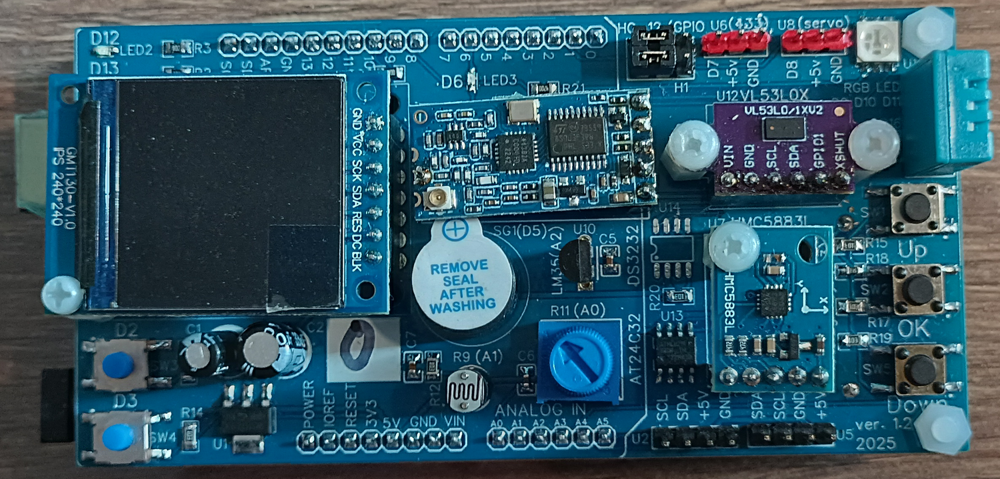
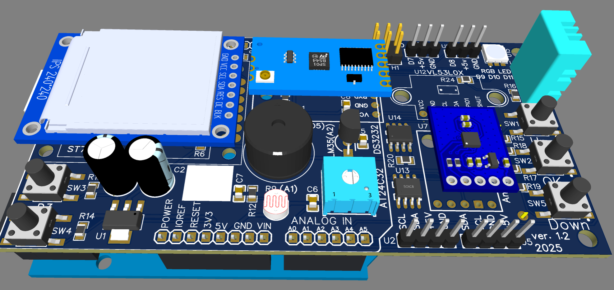

# ArduinoLab — Arduino Uno Sensor & Test Shield

 

## Overview

**ArduinoLab** (rev. 1.2, 2025) is an Arduino Uno-compatible shield that combines
a display, a set of common sensors, buttons, a wireless module and several
peripheral ICs on a single board. It was designed as a learning / diagnostic
platform: a single board on which you can practice working with I2C sensors,
SPI displays, EEPROM, an RTC, a radio module and buttons — without wiring up
a breadboard.

## Repository contents

- **`doc/`** — datasheets for the ICs and modules used on (or connectable to)
  the board: display/graphics (`Adafruit_GFX.pdf`), EEPROM (`AT24C32__64.pdf`),
  HC-12 radio module, compass (`HMC5883L.pdf`, `QMC5883L Datasheet 1.0.pdf`),
  distance sensor (`VL53L0X.PDF`, `vl53l0x.pdf`), load cell amplifier
  (`HX711_v0_0_B.pdf`, `hx711F_EN.pdf`), IMU (`mpu6050.pdf` and a Russian-language
  article on first use of the MPU6050 with STM32), plus a general reference
  article (`AaSI-2015-1-11.pdf`).
- **`hard/`** — hardware design files: schematic (`Schematic_ArduinoLab_2025-08-20.pdf`),
  bill of materials (`BOM_ArduinoLab_2025-08-20.csv/.xls`), PCB manufacturing
  files (`Gerber_ArduinoLab_PCB_ArduinoLab_12_end_2025-08-20.zip`), pick-and-place
  file (`PickAndPlace_PCB_ArduinoLab_12_end_2025-08-20.csv/.xls`), and board
  photos/renders in `Picture/` (top view, buttons close-up, and 3D renders).
- **`soft/`** — firmware and software; see **[`soft/README.md`](soft/README.md)**
  for a full description of every example. In short:
  - `ArduinoLabTest/` — the original, non-menu-driven test sketch for the whole board.
  - `examples/` — 19 numbered example sketches, from simple display demos up
    to the final menu-driven diagnostic firmware (`19_ArduinoLab_Diagnostics`).
  - `lib/` — the third-party Arduino libraries needed to compile the examples above.
- **`README.md`** — this file.

> **Note:** the final diagnostic sketch (`soft/examples/19_ArduinoLab_Diagnostics`)
> is written against a custom `MiniTFT` display library (`#include <MiniTFT.h>`),
> which is **not included in this repository** — it lives in its own repository:
> **[pav2000/MiniTFT_ST7789](https://github.com/pav2000/MiniTFT_ST7789)**.
> Download/clone it into `Arduino/libraries/MiniTFT` before that specific
> example will compile. Every other example uses only the libraries already
> present in `soft/lib/`.

## Features

- On-screen menu navigated with three buttons (Up / OK / Down), showing live
  sensor readings that refresh once a second (in the final `19_ArduinoLab_Diagnostics` example).
- Startup screen with firmware version, free RAM and an I2C bus scan.
- Individual, selectable test for every sensor and peripheral on the board.
- Automatic detection of HMC5883L vs. QMC5883L compass chip (many "GY-273"
  modules actually carry a QMC5883L clone) — used both in the diagnostic
  firmware and demonstrated separately in `soft/examples/05_QMC5883_compass`.
- A wide range of standalone example sketches for every sensor, the display,
  and even optional external modules (MPU6050 IMU, HX711 load cell) that can
  be connected via the board's spare I2C/digital headers.

## Onboard components

| Ref. | Component | Interface | Purpose |
|---|---|---|---|
| TFT1 | ST7789 IPS display, 240×240, 1.3" | SPI | Menu and test results |
| U7 | HMC5883L / QMC5883L | I2C (0x1E or 0x0D) | 3-axis compass |
| U12 | VL53L0X | I2C (0x29) | Time-of-flight distance sensor |
| U14 | DS3232 | I2C (0x68) | Real-time clock (with CR2032 backup battery, BT1) |
| U13 | AT24C32 | I2C (0x50) | 32 Kbit EEPROM |
| U9 (labelled DHT11 on board) | DHT11 | 1-wire (digital) | Temperature & humidity |
| — | LM35 | Analog (A2) | Temperature sensor |
| — | Photoresistor (LDR) | Analog (A1) | Light level sensor |
| — | Potentiometer | Analog (A0) | Variable-resistor / general analog input |
| U16 | HC-12 | UART (SoftwareSerial) | 433 MHz wireless transceiver |
| SG1 | Piezo buzzer | Digital (D5), via transistor | Sound output |
| — | Addressable RGB LED | Digital | Status indication |
| SW1 / SW2 / SW5 | Up / OK / Down buttons | Analog ladder (A3) | Menu navigation |
| SW3 / SW4 | Push buttons | Digital (D2 / D3) | General-purpose input test |
| U1 | AMS1117-3.3 | — | 3.3 V regulator for I2C sensors / display logic |

Additional breakouts: full analog pin header (A0–A5), power header
(IOREF / RESET / 3V3 / 5V / GND / VIN), and spare digital pin headers
(D7 / D8, with +5V/GND) for expansion modules (e.g. an external MPU6050 or HX711).

---

# ArduinoLab — плата-шилд для Arduino Uno с датчиками и тестами

 

## Обзор

**ArduinoLab** (ревизия 1.2, 2025) — это плата-шилд, совместимая с Arduino Uno,
которая объединяет на одной плате экран, набор распространённых датчиков,
кнопки, беспроводной модуль и несколько периферийных микросхем. Плата
задумана как учебная/диагностическая платформа: одна плата, на которой можно
практиковаться в работе с I2C-датчиками, SPI-экраном, EEPROM, часами
реального времени, радиомодулем и кнопками — без макетной платы и проводов.

## Содержимое репозитория

- **`doc/`** — даташиты микросхем и модулей, установленных на плате (или
  подключаемых к ней): дисплей/графика (`Adafruit_GFX.pdf`), EEPROM
  (`AT24C32__64.pdf`), радиомодуль HC-12, компас (`HMC5883L.pdf`,
  `QMC5883L Datasheet 1.0.pdf`), дальномер (`VL53L0X.PDF`, `vl53l0x.pdf`),
  усилитель тензодатчика (`HX711_v0_0_B.pdf`, `hx711F_EN.pdf`), гироскоп-
  акселерометр (`mpu6050.pdf` и статья на русском про первое включение
  MPU6050 на STM32), а также общая справочная статья (`AaSI-2015-1-11.pdf`).
- **`hard/`** — файлы аппаратной части: схема (`Schematic_ArduinoLab_2025-08-20.pdf`),
  спецификация компонентов (`BOM_ArduinoLab_2025-08-20.csv/.xls`), файлы для
  изготовления платы (`Gerber_ArduinoLab_PCB_ArduinoLab_12_end_2025-08-20.zip`),
  файл для автоматической установки компонентов
  (`PickAndPlace_PCB_ArduinoLab_12_end_2025-08-20.csv/.xls`), фото и рендеры
  платы в папке `Picture/` (вид сверху, кнопки крупным планом, 3D-рендеры).
- **`soft/`** — прошивка и программное обеспечение; полное описание каждого
  примера — в **[`soft/README.md`](soft/README.md)**. Коротко:
  - `ArduinoLabTest/` — исходный тестовый скетч для всей платы (без меню).
  - `examples/` — 19 пронумерованных примеров: от простых демо экрана до
    финальной диагностической прошивки с меню (`19_ArduinoLab_Diagnostics`).
  - `lib/` — сторонние Arduino-библиотеки, нужные для сборки этих примеров.
- **`README.md`** — этот файл.

> **Важно:** финальный диагностический скетч (`soft/examples/19_ArduinoLab_Diagnostics`)
> написан с использованием собственной библиотеки экрана `MiniTFT`
> (`#include <MiniTFT.h>`), которой **нет в этом репозитории** — она лежит в
> отдельном репозитории: **[pav2000/MiniTFT_ST7789](https://github.com/pav2000/MiniTFT_ST7789)**.
> Скачайте/склонируйте её в `Arduino/libraries/MiniTFT`, прежде чем именно
> этот пример соберётся. Все остальные примеры используют только библиотеки,
> уже лежащие в `soft/lib/`.

## Возможности

- Меню на экране с навигацией тремя кнопками (Up / OK / Down), «живые»
  показания датчиков обновляются раз в секунду (в финальном примере
  `19_ArduinoLab_Diagnostics`).
- Стартовый экран с версией прошивки, объёмом свободной RAM и результатами
  сканирования шины I2C.
- Отдельный, выбираемый из меню тест для каждого датчика и узла платы.
- Автоматическое определение реального чипа компаса — HMC5883L или
  QMC5883L (многие модули "GY-273" на деле содержат клон QMC5883L) — как в
  диагностической прошивке, так и отдельно в примере `soft/examples/05_QMC5883_compass`.
- Большой набор самостоятельных примеров под каждый датчик, экран, и даже
  опциональные внешние модули (гироскоп-акселерометр MPU6050, усилитель
  тензодатчика HX711), которые можно подключить через запасные
  I2C/цифровые пины платы.

## Установленные на плате устройства

| Обозн. | Компонент | Интерфейс | Назначение |
|---|---|---|---|
| TFT1 | IPS-экран ST7789, 240×240, 1.3" | SPI | Меню и результаты тестов |
| U7 | HMC5883L / QMC5883L | I2C (0x1E или 0x0D) | 3-осевой компас |
| U12 | VL53L0X | I2C (0x29) | Лазерный дальномер (time-of-flight) |
| U14 | DS3232 | I2C (0x68) | Часы реального времени (с батарейкой CR2032, BT1) |
| U13 | AT24C32 | I2C (0x50) | EEPROM на 32 Кбит |
| U9 (подписан DHT11 на плате) | DHT11 | 1-wire (цифровой) | Температура и влажность |
| — | LM35 | Аналоговый (A2) | Датчик температуры |
| — | Фоторезистор (LDR) | Аналоговый (A1) | Датчик освещённости |
| — | Потенциометр | Аналоговый (A0) | Переменный резистор / общий аналоговый вход |
| U16 | HC-12 | UART (SoftwareSerial) | Беспроводной трансивер 433 МГц |
| SG1 | Пьезозуммер | Цифровой (D5), через транзистор | Звуковой выход |
| — | Адресный RGB-светодиод | Цифровой | Индикация состояния |
| SW1 / SW2 / SW5 | Кнопки Up / OK / Down | Аналоговая лесенка (A3) | Навигация по меню |
| SW3 / SW4 | Кнопки | Цифровые (D2 / D3) | Тест обычного цифрового входа |
| U1 | AMS1117-3.3 | — | Стабилизатор 3.3В для I2C-датчиков/логики экрана |

Дополнительно на плате разведены: полный набор аналоговых пинов (A0–A5),
разъём питания (IOREF / RESET / 3V3 / 5V / GND / VIN) и запасные цифровые
пины (D7 / D8, с выводами +5V/GND) для подключения дополнительных модулей
(например, внешнего MPU6050 или HX711).
